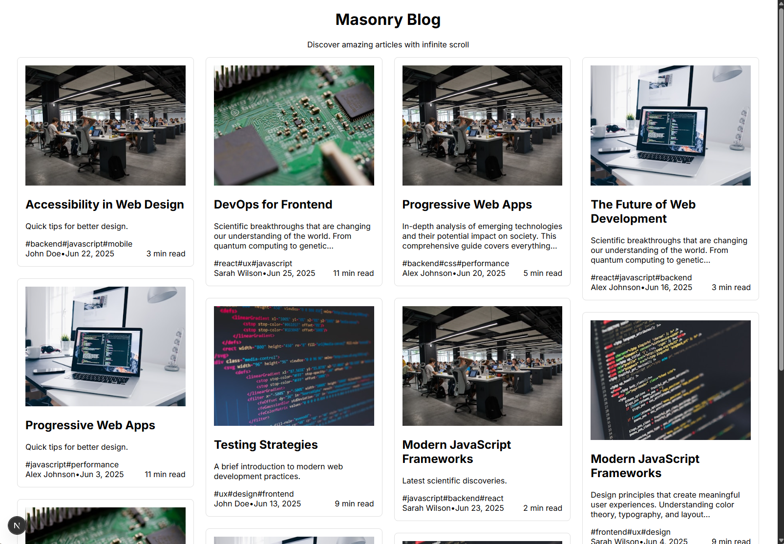

# Masonry Articles Blog [boilerplate]

[](https://e-nicko.github.io/masonry-blog-layout-nextjs/)
[](https://opensource.org/licenses/MIT)
<br>
[](https://nextjs.org/)
[](https://www.typescriptlang.org/)
[](https://tailwindcss.com/)
[](https://www.framer.com/motion/)

A a responsive masonry blog layout built with Next.js, featuring infinite scroll and smooth animations powered by Framer Motion.

<a href="screenshot.png">

</a>

## Features

✨ **Adaptive Masonry Layout**: CSS-based masonry grid that automatically adjusts to different screen sizes
🔄 **Infinite Scroll**: Seamless loading of more articles as you scroll down
🎭 **Smooth Animations**: Staged animations for article appearance using Framer Motion
📱 **Responsive Design**: Optimized for desktop, tablet, and mobile devices
⚡ **Performance Optimized**: Efficient loading and rendering of articles
🎨 **Modern UI**: Clean, professional design with hover effects and transitions

## Tech Stack

- **Next.js 15.3.4** - React framework with App Router
- **TypeScript** - Type-safe development
- **Tailwind CSS** - Utility-first CSS framework
- **Framer Motion** - Animation library for React
- **React Intersection Observer** - Efficient scroll detection for infinite scroll

## Getting Started

### Prerequisites

- Node.js 18+
- npm or yarn

### Installation

1. Clone the repository:

```bash
git clone <repository-url>
cd masonry-blog
```

2. Install dependencies:

```bash
npm install
```

3. Start the development server:

```bash
npm run dev
```

4. Open [http://localhost:3000](http://localhost:3000) in your browser.

## Documentation

For a detailed explanation of how the masonry layout was implemented, please see the [**Masonry Implementation Guide**](./docs/masonry-implementation.md).

## Project Structure

```
src/
├── app/
│   ├── globals.css          # Global styles and utilities
│   ├── layout.tsx           # Root layout
│   └── page.tsx             # Home page
├── components/
│   ├── ArticleCard.tsx      # Individual article card component
│   ├── BlogLayout.tsx       # Main blog layout with infinite scroll
│   ├── ErrorState.tsx       # Error and empty state components
│   ├── LoadingAnimations.tsx # Various loading animation components
│   └── ReactMasonryGrid.tsx # Masonry layout component
├── data/
│   └── mockArticles.ts      # Mock article data generator
├── hooks/
│   └── useInfiniteScroll.ts # Custom hook for infinite scroll functionality
└── types/
    └── article.ts           # TypeScript interfaces
```

## Key Components

### [`ReactMasonryGrid.tsx`](./src/components/ReactMasonryGrid.tsx)

- CSS-based masonry layout using `column-count` and `column-gap`
- Responsive design that adapts to different screen sizes
- Smooth animations for item appearance

### [`ArticleCard.tsx`](./src/components/ArticleCard.tsx)

- Individual article display with image, title, excerpt, and metadata
- Hover effects and micro-interactions
- Staged animations with staggered delays

### [`useInfiniteScroll.ts`](./src/hooks/useInfiniteScroll.ts)

- Custom hook managing infinite scroll state
- Intersection Observer for efficient scroll detection
- Error handling and retry functionality

### [`BlogLayout.tsx`](./src/components/BlogLayout.tsx)

- Main container managing article loading and display
- Integration of masonry grid and infinite scroll
- Loading states and error handling

## Animations

The project features several types of animations:

1. **Staged Article Appearance**: Articles animate in with staggered delays
2. **Hover Effects**: Smooth transitions on article hover
3. **Loading Animations**: Multiple loading spinner variations
4. **Scroll Animations**: Smooth transitions when loading more content

## Customization

### Adding New Articles

Modify [`src/data/mockArticles.ts`](./src/data/mockArticles.ts) to add new articles or change the data structure.

### Styling

- Update [`src/app/globals.css`](./src/app/globals.css) for global styles
- Modify Tailwind classes in components for styling changes
- Adjust animation parameters in Framer Motion components

### Layout Configuration

- Change masonry column width in the [`ReactMasonryGrid.tsx`](./src/components/ReactMasonryGrid.tsx) component
- Adjust infinite scroll trigger distance in the [`useInfiniteScroll.ts`](./src/hooks/useInfiniteScroll.ts) hook
- Modify responsive breakpoints in CSS

## Performance Considerations

- Images are optimized using Next.js Image component
- Intersection Observer provides efficient scroll detection
- CSS-based masonry layout for better performance than JavaScript solutions
- Staged animations prevent layout thrashing

## Browser Support

- Modern browsers supporting CSS Grid and Flexbox
- ES2017+ JavaScript features
- Intersection Observer API (with polyfill for older browsers)

## Contributing

1. Fork the repository
2. Create a feature branch
3. Make your changes
4. Test thoroughly
5. Submit a pull request

## License

MIT License - feel free to use this project for your own purposes.

## Acknowledgments

- Images provided by Unsplash
- Icons and animations inspired by modern design patterns
- Built with the amazing Next.js and React ecosystem
